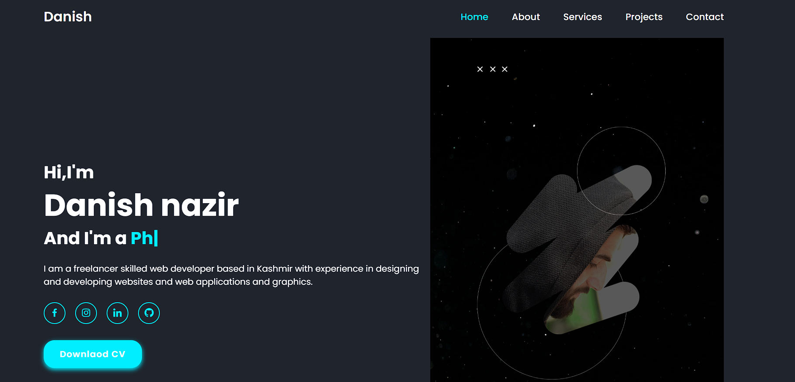

# Personal-Blog
# PersonalBlog

# project--documentation

<p align="center">
  <a href="https://danish20699.github.io/Personal-Blog/" rel="noopener">
 
  <p>click the image to see the portfolio UI</p></a>


<h3 align="center">Personal Portfolio</h3>

---

<p align="center"> Few lines describing your project.
    <br> 
</p>

## 📝 Table of Contents
- [About](#about)
- [Getting Started](#getting_started)
- [Deployment](#deployment)
- [Usage](#usage)
- [TODO](../TODO.md)
- [Contributing](../CONTRIBUTING.md)
- [Acknowledgments](#acknowledgement)

## 🧐 About <a name = "about"></a>
A personal portfolio is a collection of your professional or creative work, accomplishments, skills, and experiences that you use to showcase your abilities and promote yourself to potential employers, clients, or collaborators. It can include a range of materials, such as writing samples, design projects, photographs, videos, code samples, certificates, awards, and testimonials.

Having a well-designed and organized personal portfolio can help you stand out from other candidates and demonstrate your competence and creativity. It can also serve as a record of your progress and growth over time, as you add new projects and skills to your portfolio.

When creating a personal portfolio, it's important to consider your target audience and their interests and needs, and to select your best and most relevant work to showcase. You should also provide context and explanations for each item in your portfolio, highlighting the skills and expertise you used to complete each project.

There are various platforms and tools available for creating and hosting a personal portfolio, including website builders, social media platforms, and specialized portfolio platforms. It's important to choose a platform that fits your needs and goals, and to keep your portfolio updated and relevant as you continue to develop your skills and experiences

## 🏁 Getting Started <a name = "getting_started"></a>
These instructions will get you a copy of the project up and running on your local machine for development and testing purposes. See [deployment](#deployment) for notes on how to deploy the project on a live system.

### Prerequisites
What things you need to install the software and how to install them.

```
Give examples
```

### Installing
A step by step series of examples that tell you how to get a development env running.

Say what the step will be

```
Give the example
```

And repeat

```
until finished
```

End with an example of getting some data out of the system or using it for a little demo.

## 🔧 Running the tests <a name = "tests"></a>
Explain how to run the automated tests for this system.

### Break down into end to end tests
Explain what these tests test and why

```
Give an example
```

<<<<<<< HEAD


=======
>>>>>>> ccb3ef98e38119bc8d4d95dd9750ea018ced0479
## 🎈 Usage <a name="usage"></a>
Add notes about how to use the system.

## 🚀 Deployment <a name = "deployment"></a>
Add additional notes about how to deploy this on a live system.


- [HTML]
- [CSS]
- [JavaScript]
- [ScrollReveal]


See also the list of [contributors](https://github.com/kylelobo/The-Documentation-Compendium/contributors) who participated in this project.

## 🎉 Acknowledgements <a name = "acknowledgement"></a>
- Hat tip to anyone whose code was used
- Inspiration
- References
